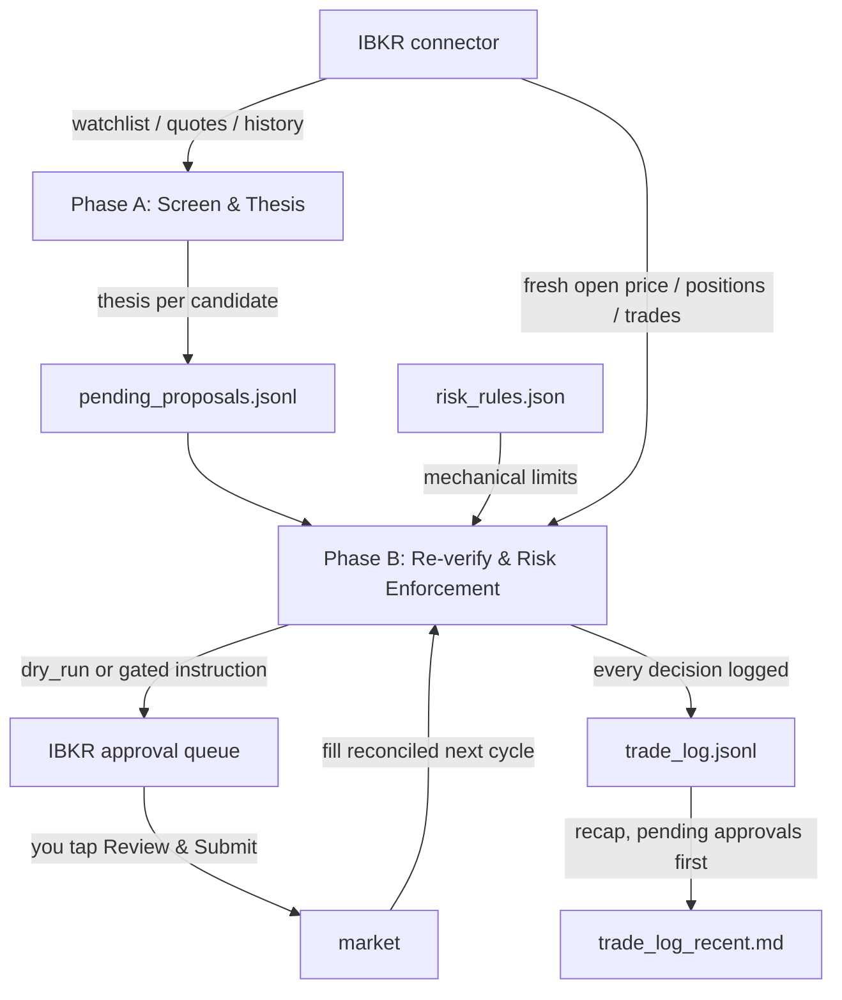

# FriesTrader


An AI trading agent built to run cheap, on a schedule, against a real
[Interactive Brokers](https://www.interactivebrokers.com) account via
IBKR's official Claude connector. Two short scheduled Claude Code
sessions a day screen stocks, write out their reasoning, enforce
mechanical risk rules, and queue up trade instructions — **which you
approve with a tap in the IBKR app before anything reaches the market.**
No team of specialized sub-agents burning tokens on every decision. The
actual safety mechanism is mechanical, auditable risk rules, not the
model's judgment, and because it's just two lean sessions instead of a
multi-agent pipeline, it runs comfortably on a Claude Pro subscription
(as low as $200/year on the annual plan), no Claude Max or metered API
spend required.

**The research runs itself; the trigger stays yours.** IBKR's connector
cannot place orders — `create_order_instruction` produces a draft that
sits in IBKR's queue until you tap *Review & Submit*. Anthropic's own
connector documentation puts it plainly: *"Claude never submits orders
directly to the market."* So this is a **propose-and-approve** system,
not an unattended one. What you get for that tap: no VPS, no gateway
process, no weekly re-authentication, and a human check on every single
trade.

> **If you want genuinely unattended execution**, it exists but costs
> more: the `ibkr-tws-gateway` branch of this repo implements the same
> pipeline against the TWS API, with real resting GTC stop orders and
> fully automatic fills. It needs an always-on Linux VPS running IB
> Gateway and about one 2FA tap per week. Same risk rules, same scripts,
> different execution layer.

This is a template/framework extracted from a real, live deployment.
Adapt it, don't just run it blind — read "What this does and doesn't
solve" below before pointing it at real money.

## Why this is safer than it sounds

"AI" and "trading real money" together should make you nervous. Here's
what actually stands between a thesis and an order:

- **Nothing executes without you.** Every trade lands in IBKR's approval
  queue as a draft. The pipeline cannot submit it, and this is enforced
  by IBKR, not by anything in this repo.
- **Every trade passes through mechanical rules the LLM cannot
  override** — position sizing, stop-loss, take-profit, daily/weekly
  loss limits, a wash-sale guard. A good story never cancels a
  stop-loss. Your approval tap is a check **on top of** those rules, not
  a substitute: a candidate that fails a rule is never queued "to let you
  decide".
- **New deployments start in `dry_run` and stay there** for a minimum
  number of cycles (`dry_run_min_cycles_before_live`) before a live
  order is even possible, so you can watch it screen and reason before
  it touches real money.
- **Only you can flip `execution.mode` to `"live"`** — the agent is
  explicitly barred from ever changing this itself, and refuses to
  place live orders while `dry_run`.
- **Every decision is logged, approved or rejected** — `trade_log.jsonl`
  is append-only, so you can check whether the reasoning is actually
  sound, not just trust it.

## What you give up versus the Robinhood original

This is a template extracted from a Robinhood deployment and ported to
IBKR. Three capabilities did not survive the move, and you should know
them before adopting it:

| Lost | Why | What replaces it |
|---|---|---|
| **Intraday stop protection** | `create_order_instruction` supports MARKET and LIMIT only — **no stop order type**, so no resting stop can sit at the broker | A once-a-day check in Phase B, whose sell still waits for your tap. A position can gap down at 10am and stay held until you open the app. |
| **Market scan** | The connector has no scanner; `search_investment_topics` is thematic browsing, not screening | Nothing. **Your watchlist is the entire universe** — the pipeline can't discover anything you didn't put in front of it. |
| **Market-cap filter** | The connector exposes no market cap at any endpoint | A 90-day dollar-volume floor stands in for the size floor. **Nothing replaces the ceiling** — keep mega-caps off your watchlist yourself. |

The wash-sale guard and the loss limits are also partial: the connector
sees only the account it's connected to, and realized P&L only covers
sells this pipeline originated. Both log their own incompleteness every
cycle rather than reading as a complete check.

The `ibkr-tws-gateway` branch restores all of the above, at the cost of a
VPS.

## Requirements

- An [Interactive Brokers](https://www.interactivebrokers.com) account
  with the [IBKR connector](https://claude.com/connectors/interactive-brokers)
  connected to Claude.
- [Claude Code](https://claude.com/claude-code), on a Pro subscription or
  higher.
- Python 3.9+ — the scripts are stdlib-only by design, nothing to install.
- A GitHub account, to host your own fork of this repo.
- **A phone you check on weekday mornings.** Queued instructions do
  nothing until you approve them.

## How it works

Trading runs as **two separate phases, on two separate schedules** — a
full trading day's closing data feeds the thesis, and a fresh opening
price is used for the actual order, rather than trading on a stale
overnight price.



Note the loop back through **you**. Because a fill can only happen after
your tap, Phase B's first job each morning is reconciling what you did (or
didn't) approve since yesterday: approved-and-filled, declined, or still
sitting. Declines are treated as deliberate overrides — the pipeline does
not re-propose something you turned down.

- **Phase A** (Steps 1–3, ~4:30pm Central weekdays) — screens candidates
  from your IBKR watchlist, gathers signals, writes a logged thesis per
  candidate to `pending_proposals.jsonl`. Queues nothing, not even
  dry-run instructions. Full spec: `PHASE_A_TASK.md`.
- **Phase B** (Steps 4–7, ~8:35am Central weekdays) — reconciles what you
  approved or declined overnight, re-verifies Phase A's proposals against
  fresh opening data, enforces `risk_rules.json` mechanically, and
  dry-runs or (gated) queues instructions for your approval. Full spec:
  `PHASE_B_TASK.md`.

Both run as scheduled Claude Code sessions — each run clones this repo
fresh and commits/pushes its results back to `main`, so the repo itself
is the persistent state, not local disk.

- `risk_rules.json` — the hard, mechanical limits (position sizing, stop-
  loss, loss limits, universe filters, execution mode, wash-sale guard).
  Nothing in this system should be able to override these. Several
  fields need your own account details before this is usable — see
  First-time setup below.
- `PHASE_A_TASK.md` / `PHASE_B_TASK.md` — the full, self-contained spec
  each phase follows.
- `scripts/*.py` — every piece of arithmetic the pipeline does: signal
  ratios, P&L percentages, realized P&L, stop-loss, take-profit tiers,
  position sizing, candidate ranking, and the dollar→share conversion the
  IBKR order format requires. Deliberately not left to the LLM, and
  stdlib-only so they stay auditable and testable.
- `trade_log_template.jsonl` — the log line shapes; real logs accumulate
  in `trade_log.jsonl` in this same style. Note `instruction` and `order`
  are **different stages**: queued-awaiting-you versus actually-filled.

## See it in action

This is what a real Phase B cycle actually produces (`trade_log_recent.md`,
regenerated every run, symbols genericized):

> **2026-07-09**
>
> **⚠ 1 instruction awaiting your approval in IBKR**
> - BUY 2 OTHER ($56.80, medium conviction) — *[review link]*
>
> **Resolved since last cycle**: EXAMPLE sell — you approved, filled at
> 92.40, realized -$22.85.
>
> **Loss limit**: OK — daily 0.0%, weekly -2.1%, within -5%/-10% limits.
>
> **Held positions** (stop-loss / take-profit):
> - ANOTHER — stop 7.00% (vol-scaled), drawdown -2.3% — holding
>
> **New-entry candidates considered**: OTHER, THIRD
> - OTHER — approved: medium conviction, $60.00 (12% of account) → queued
> - THIRD — rejected: max_concurrent_positions already filled this cycle

No JSON parsing required to see what it did and why. Full field-level
examples (thesis records, raw `trade_log.jsonl` lines) are further down
in Example output.

## What this does and doesn't solve

- It gives you a structured, auditable version of "let an LLM screen and
  reason about trades" instead of an opaque one.
- It does **not** make LLM-driven stock picking more likely to beat a
  simple index fund — there's no established track record for that, and
  this can't backtest the reasoning step honestly (news-based reasoning
  can't be validated against historical data the model may already know
  the outcome of).
- The risk rules are the actual safety mechanism here, not the reasoning
  quality. Treat loosening them as the highest-risk change you can make
  to this system.
- This is a template extracted from a real deployment trading a small
  personal account, shared for others to learn from or adapt. It is
  genuinely not financial advice, and running it against real money is
  entirely your own decision and risk.

## First-time setup

1. **Fork this repo** (or otherwise create your own copy) to your own
   GitHub account — make it private, since it'll accumulate real trading
   data (`trade_log.jsonl`, proposals) once running. Phase A/B commit and
   push results back to `main`, so you need a repo you actually control,
   not this one.
2. **Use a dedicated IBKR account**, funded with only what you're willing
   to have this system trade — not your main investing account. Connect
   the [IBKR connector](https://claude.com/connectors/interactive-brokers)
   to Claude. Nothing below works without it: every market and account
   call in `PHASE_A_TASK.md`/`PHASE_B_TASK.md` goes through it.
3. **Verify the connector works in a *scheduled* run, not just an
   interactive one.** The connector is interactively authenticated, and a
   headless or cron-triggered session may not have it loaded at all.
   Schedule a throwaway run that just calls `get_account_summary` and
   confirm it succeeds before trusting anything else. Phase B's Step 0
   preflight fails safe if the connector is missing — it stops and queues
   nothing — but a pipeline that silently does nothing every day is easy
   not to notice.
4. Fill in `account_number` in `risk_rules.json` with your IBKR account
   id (e.g. `U1234567`), set `starting_capital_usd` to your real starting
   balance, set `universe.watchlist_names` to one or more watchlists you've
   already created and populated in IBKR (they are unioned, duplicates
   dropped; a name that matches nothing stops the run rather than silently
   shrinking the universe), and review every other threshold — the
   defaults here are illustrative, not a recommendation. Pay particular
   attention to `position_sizing.commission_note`: IBKR charges per order
   and this pipeline queues small ones, so confirm the economics work at
   *your* account size.
5. **Curate that watchlist deliberately** — with no market scanner, it is
   the entire universe, and with no market-cap ceiling, it is also the
   only thing keeping mega-caps and leveraged products out. The
   `universe.exclude` filters are a backstop, not the primary defence.
6. Fill in `wash_sale_avoidance.linked_accounts` with every account you
   personally control, not just this one. Leave `enabled: true` unless
   you specifically want buys never blocked on wash-sale grounds. Note
   its limit: the connector can only see the account it's connected to,
   so any other account is logged as unchecked rather than assumed clean.
7. Keep `execution.mode` set to `"dry_run"`. Leave it there for at least
   the number of cycles set in `dry_run_min_cycles_before_live` — don't
   shortcut this. In `dry_run` nothing is queued at all, so this period
   is purely about reading the reasoning and the sizing.
8. After each cycle, read `trade_log.jsonl` yourself. Look specifically
   at rejected candidates and stop-loss triggers, not just the trades
   that "worked" — that's where you'll see if the reasoning step is
   actually sound or just getting lucky with an uptrend.
9. Only flip `execution.mode` to `"live"` yourself, by hand, after you've
   reviewed enough dry-run cycles to trust the output. Do not let the
   agent flip it for you as a shortcut. Remember what `"live"` means
   here: instructions start reaching your IBKR queue. Your tap is still
   what moves money.
10. **Build the habit of clearing the queue each morning.** Instructions
    you leave sitting go stale — Phase B deletes and recreates them at
    the next cycle's prices — and a stop-loss sell that waits three days
    for your attention is not a stop-loss. If you can't reliably check on
    weekday mornings, the `ibkr-tws-gateway` branch is the better fit.

## Keeping your fork updated

This template gets improvements over time.

- **Easiest: GitHub's "Sync fork" button**, on your fork's main page. No
  local git needed. Works cleanly as long as nothing conflicts with your
  own changes.
- **If that button refuses (conflicts, usually in `risk_rules.json`)**,
  resolve locally:
  ```
  git remote add upstream https://github.com/YizhiSong/FriesTrader.git
  git fetch upstream
  git merge upstream/main
  ```
  Resolve any conflicts in `risk_rules.json` by hand — your own account
  details and thresholds should win, not upstream's placeholders.

## Running it

Two schedules need to fire: Phase A around 4:30pm Central on weekdays
(hand Claude Code `PHASE_A_TASK.md` to execute), and Phase B around
8:35am Central on weekdays, 5 minutes after market open (hand it
`PHASE_B_TASK.md`). Each run is a fresh Claude Code session pointed at
this repo — no state needs to persist locally between runs, since the
repo itself (`risk_rules.json`, `pending_proposals.jsonl`,
`trade_log.jsonl`) is what's read and written each time.

- **Recommended: Claude Code's own scheduled cloud routines.** Set one
  routine to run `PHASE_A_TASK.md` on the Phase A schedule and a second
  for `PHASE_B_TASK.md` on the Phase B schedule, with the routine's
  source pointed at **your fork** from First-time setup, not this repo.
  This runs independent of any machine being on — the actual point of
  "fully automated."
- **Alternative: a local scheduler** (cron, Windows Task Scheduler, etc.)
  invoking the Claude Code CLI against your fork on the same two
  schedules. Works, but only while that machine is running, and you're
  responsible for keeping the repo synced (`git pull` before, `git push`
  after each run) since the repo — not local disk — is the source of
  truth. If you go this route, make sure only one scheduler is ever
  active for a given phase — two schedulers firing the same phase in the
  same cycle risks duplicate `risk_check`/`instruction` log entries, or
  two instructions for the same symbol sitting in your approval queue
  once `execution.mode` is `"live"`. That second one matters: approving
  both is how you accidentally double a position with two taps.

### Routine prompt templates

The task specs don't cover scheduling, dates, or saving results — that's
up to whatever runs them. These are the real prompts this project's live
deployment uses; copy one in and swap in your own account number.

#### Phase A prompt

```
You are running the DAILY automated Phase A step (screening & thesis only) for a small real personal trading account at Interactive Brokers (account_number: <your IBKR account id>), accessed through the IBKR MCP connector. This repo has already been cloned into your working directory. PHASE_A_TASK.md in this checkout is the full source-of-truth spec for what to do (Steps 1-3) — read and follow it exactly.

Two IBKR connector mechanics will bite immediately if you skip them. (1) Everything is keyed by contract_id, not ticker: resolve each symbol via search_contracts and match the `symbol` field EXACTLY — a search for "AAPL" also returns "AAPU"/"AAPB", and a near match is a different instrument. (2) Response keys are hyphenated where request names are underscored: `misc_statistics` comes back as `misc-statistics`, `avg_90d_usd_volume` as `avg-90d-usd-volume`. Reading the underscored form returns nothing, which looks identical to missing data — and missing data has real consequences in the spec, so do not confuse the two.

If a call fails or returns nothing usable, log what failed and drop that candidate. Never substitute a remembered value, an estimate, or a prior run's number for data a failed call did not return.

First, determine today's REAL date, day-of-week, and time-of-day in America/Chicago (Central) via Bash — do not guess or infer these:
TZ='America/Chicago' date +'%Y-%m-%d'
TZ='America/Chicago' date +'%A'
TZ='America/Chicago' date +'%H:%M:%S'
Use the date as the 'date' field and the time as the 'timestamp' field (time-of-day only, e.g. "16:30:01" — never prepend the date to it) on every line you write, per PHASE_A_TASK.md's Output section.

Read risk_rules.json fresh from this checkout every run — never assume prior values or cache across runs.

Follow PHASE_A_TASK.md's Steps 1-3 exactly, including the screened/thesis/summary line shapes and the End-of-run summary section. Overwrite pending_proposals.jsonl in this checkout with this run's results (do not append to prior contents). Do NOT touch trade_log.jsonl.

Hard stop: create_order_instruction and delete_order_instruction should not be available to you in this session (exclude them at the connector level if your setup allows it) — do not attempt them regardless, and do not check or reference execution.mode. Do not call any watchlist or alert WRITE tool either (create_watchlist, edit_watchlist, delete_watchlist, create_alert, update_alert, set_alert_status, delete_alert); get_watchlists/get_watchlist are read-only and expected. get_account_positions is for building the candidate list only — all risk enforcement is Phase B's job.

When pending_proposals.jsonl is fully written, commit and push it back to this repo's main branch:
git add pending_proposals.jsonl
git commit -m "Phase A run <date> <timestamp>"
git push origin main
If the push is rejected (e.g. a race with another run), run 'git pull --rebase origin main' once and retry the push once. If it still fails, report the exact conflict/error in your final summary rather than force-pushing or discarding either side's changes.

End with a concise summary of what you screened/filtered/proposed, and confirm the push succeeded (include the resulting commit hash).
```

#### Phase B prompt

```
You are running the DAILY automated Phase B step (reconcile the approval queue, re-verify, risk enforcement, order instructions, logging) for a small real personal trading account at Interactive Brokers (account_number: <your IBKR account id>), accessed through the IBKR MCP connector. This repo has already been cloned into your working directory. PHASE_B_TASK.md in this checkout is the full source-of-truth spec for what to do (Steps 0 and 4-7) — read and follow it exactly.

CRITICAL: you CANNOT execute a trade. create_order_instruction produces a DRAFT that sits in IBKR's approval queue until the human opens the IBKR app and taps Review & Submit. Never log an instruction as "placed", never treat a queued instruction as a position change, and never report a trade as done in your summary. The log keeps `instruction` (queued, awaiting a human) and `order` (actually filled, confirmed) as separate stages — do not collapse them.

The human's approval tap is a check ON TOP OF the mechanical rules, never a substitute for one. A candidate that fails any rule in risk_rules.json must never be queued "to let the human decide".

Same two connector mechanics as Phase A: contract_id keying via search_contracts with an EXACT symbol match, and hyphenated response keys where request names are underscored.

First, determine today's REAL date, day-of-week, and time-of-day in America/Chicago (Central) via Bash — do not guess or infer these, and do not compute day-of-week yourself from the date string:
TZ='America/Chicago' date +'%Y-%m-%d'
TZ='America/Chicago' date +'%A'
TZ='America/Chicago' date +'%H:%M:%S'
Use the date as the 'date' field and the time as the 'timestamp' field (time-of-day only, e.g. "08:35:01" — never prepend the date to it) on every line you write to trade_log.jsonl, per PHASE_B_TASK.md. Determine is_monday from the day-of-week output (true only if it's literally 'Monday') for the Step 4 weekend-gap check.

Read risk_rules.json fresh from this checkout every run — never assume prior values or cache across runs. Read pending_proposals.jsonl and trade_log.jsonl fresh from this checkout too.

Follow PHASE_B_TASK.md's Steps 0 and 4-7 exactly, including Step 0's connector preflight and instruction-queue reconciliation (what did the human approve, decline, or leave sitting since yesterday?), the idempotency rule (key off each candidate's own proposal_date, not today's date), the dry-run cycle count rule, the priority/tiebreak rules, and the instruction gate in Step 6. Do not add, remove, or loosen any condition of that gate on your own judgment, and never change execution.mode or any other value in risk_rules.json yourself.

Never re-propose an instruction the human declined, on that basis alone — a decline is a deliberate human override of a mechanical rule, and repeating it is overruling them by repetition. Before creating any instruction, check get_order_instructions for an existing pending one for the same symbol; two instructions for one symbol in the queue is how a position gets accidentally doubled with two taps.

Append every decision to trade_log.jsonl (do not touch pending_proposals.jsonl except to read it). When done, commit and push trade_log.jsonl back to this repo's main branch:
git add trade_log.jsonl
git commit -m "Phase B run <date> <timestamp>"
git push origin main
If the push is rejected (e.g. a race with another run), run 'git pull --rebase origin main' once and retry the push once. If it still fails, report the exact conflict/error in your final summary rather than force-pushing or discarding either side's changes — this file is an append-only audit trail, treat any conflict here as serious and report it clearly rather than guessing how to resolve it.

End with a concise summary of what you checked, approved, rejected, and (if applicable) QUEUED FOR APPROVAL — stating clearly that queued instructions have not executed and need a tap in the IBKR app. Lead that summary with the count of instructions now awaiting approval. Confirm the push succeeded (include the resulting commit hash).
```

### Example output

**Phase A — thesis record** (one JSON line per candidate in
`pending_proposals.jsonl`):

```json
{
  "date": "YYYY-MM-DD",
  "timestamp": "HH:mm:ss",
  "symbol": "XXXX",
  "stage": "thesis",
  "thesis": "1-3 sentences on what changed and why it might matter",
  "conviction": "low | medium | high",
  "invalidation": "what would prove this thesis wrong",
  "direction": "long | avoid | exit_existing",
  "risk_flags": ["..."],
  "pct_below_52wk_high": 0.15,
  "sources": ["Outlet Name: https://...", "..."]
}
```

`risk_flags` and `pct_below_52wk_high` are only included when
`direction` is `"long"` — omitted for `avoid`/`exit_existing`.

- **No price targets** — no reliable basis for a specific number, and it
  invites false precision.
- **No forecasting language treated as fact** — "this suggests...", not
  "this will...".

**Phase B — `trade_log.jsonl`** (the durable, append-only source of
truth — one line per decision; `trade_log_recent.md` below is just its
daily recap):

```json
{"date": "2026-07-10", "timestamp": "08:38:10", "symbol": "EXAMPLE", "stage": "risk_check", "passed": true, "conviction": "medium", "risk_flags": [], "pct_below_52wk_high": 0.08, "proposal_date": "2026-07-09", "position_size_usd": 60.00, "concurrent_positions_after": 2, "cash_remaining_after": 340.00, "cash_buffer_after_pct": 0.34}
{"date": "2026-07-10", "timestamp": "08:38:30", "symbol": "OTHER", "stage": "stop_loss", "entry_price": 100.00, "current_price": 92.50, "stop_pct_used": 0.075, "stdev_20d": 0.030, "drawdown_pct": 0.075, "triggered": true, "action": "sell_full_position"}
{"date": "2026-07-10", "timestamp": "08:39:01", "symbol": "OTHER", "stage": "instruction", "action": "created", "mode": "live", "instruction_id": "417", "url": "https://ndcdyn.interactivebrokers.com/…/orders/instructions", "creation_time": "2026-07-10T13:39:01.283Z", "expiration": "2026-07-17T13:39:01.283Z", "side": "SELL", "quantity": 3, "reference_price": 92.50, "actual_notional": 277.50, "average_cost_at_instruction": 100.00, "reason": "stop_loss", "proposal_date": "2026-07-09"}
{"date": "2026-07-11", "timestamp": "08:35:20", "symbol": "OTHER", "stage": "order", "resolved_from_instruction": true, "instruction_id": "417", "placed": true, "action": "sell", "fill_price": 92.40, "fill_quantity": 3, "commission": 1.00, "realized_pnl": -22.85, "reason": "stop_loss"}
{"date": "2026-07-11", "timestamp": "08:35:22", "symbol": "THIRD", "stage": "order", "resolved_from_instruction": true, "instruction_id": "418", "placed": false, "reason": "instruction expired unapproved after 7 days", "expiration": "2026-07-17T13:39:01.283Z"}
```

Follow the `instruction_id` through those last three lines: **queued on
the 10th, resolved on the 11th** — nothing happened in between except
your tap. `instruction` and `order` are separate stages precisely so the
log can never claim a trade that only ever sat in a queue.

`expiration` is load-bearing, not decoration. **IBKR expires an
instruction exactly 7 days after creation** (measured, not assumed), and
an expired instruction vanishes from the queue in exactly the same way a
declined one does. Recording the expiry is what lets the next cycle tell
them apart — as the last line does. A decline is your decision and the
pipeline respects it; an expiry means the queue went unread, which is a
different problem and gets flagged as one.

The `url` is a single link to the whole instructions queue, identical for
every instruction — not a per-order deep link.

**Phase B — `trade_log_recent.md`** (regenerated every Phase B run, a
plain-English recap for a quick mobile/GitHub read, no JSON-parsing
required — symbols genericized, not a real account):

> **2026-07-09**
>
> **⚠ 1 instruction awaiting your approval in IBKR**
> - BUY 2 OTHER ($56.80, medium conviction) — *[review link]*
>
> **Resolved since last cycle**: EXAMPLE sell — you approved, filled at
> 92.40, realized -$22.85.
>
> **Loss limit**: OK — daily 0.0%, weekly -2.1%, within -5%/-10% limits.
>
> **Held positions** (stop-loss / take-profit):
> - ANOTHER — stop 7.00% (vol-scaled), drawdown -2.3% — holding
>
> **New-entry candidates considered**: OTHER, THIRD
> - OTHER — approved: medium conviction, $60.00 (12% of account) → queued
> - THIRD — rejected: max_concurrent_positions already filled this cycle

## License

MIT — see `LICENSE`. Provided as-is, with no warranty; see the license
for the full disclaimer.
